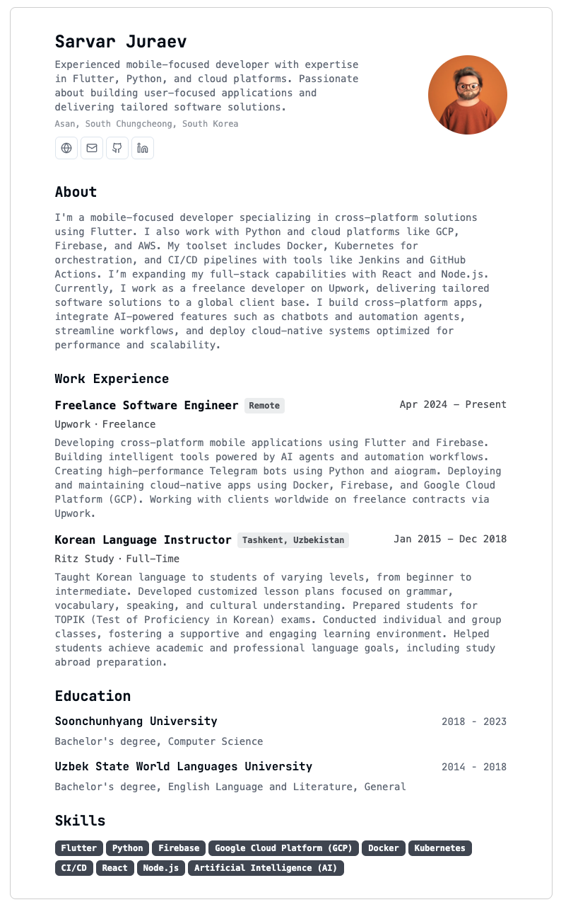

# My Flutter Resume

A cross-platform personal resume/portfolio application built with Flutter. This project serves as a digital showcase of my skills, experience, and projects.

## 📸 Screenshot

  

## ✨ Features

- **Cross-Platform:** Built with Flutter to run on mobile, web, and desktop from a single codebase.
- **Custom UI:** A unique and clean design using custom fonts and assets.
- **Contact Information:** Quick access to my professional profiles and contact details.
- **(Planned) Interactive Timeline:** A visual representation of my career journey and education.
- **(Planned) Project Showcase:** A dedicated section to display my key projects with descriptions and links.

## 🛠️ Tech Stack

- **Framework:** [Flutter](https://flutter.dev/)
- **Language:** [Dart](https://dart.dev/)
